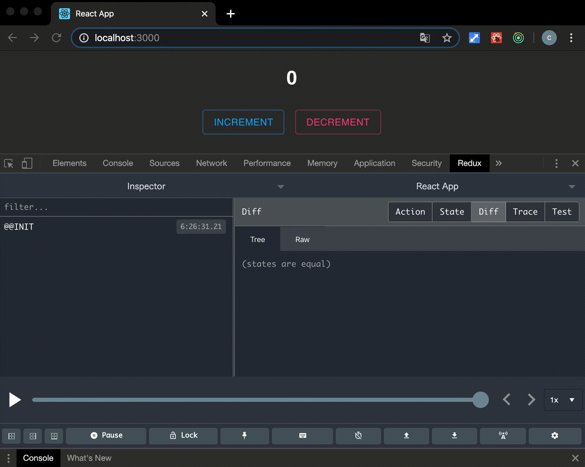

This project was bootstrapped with [Create React App](https://github.com/facebook/create-react-app).
# Count Up/ Down Button Application

This is a simple count up/ down button application using React-Redux and TypeScript.  
Hope this helps you to study React-Redux with TypeScript or start to make new React-Redux application.

Updated on 2020/5/31: Add sample using Redux Toolkit in redux-toolkit branch.

## Available Scripts

In the project directory, you can run:

### `npm start`

Runs the app in the development mode. 
Open [http://localhost:3000](http://localhost:3000) to view it in the browser.

The page will reload if you make edits. 
You will also see any lint errors in the console.

